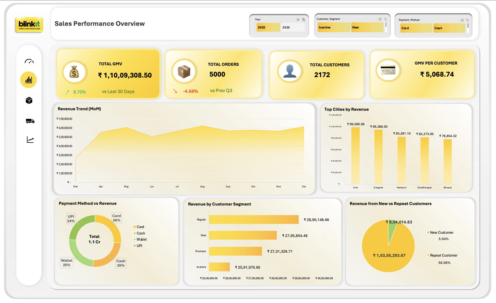
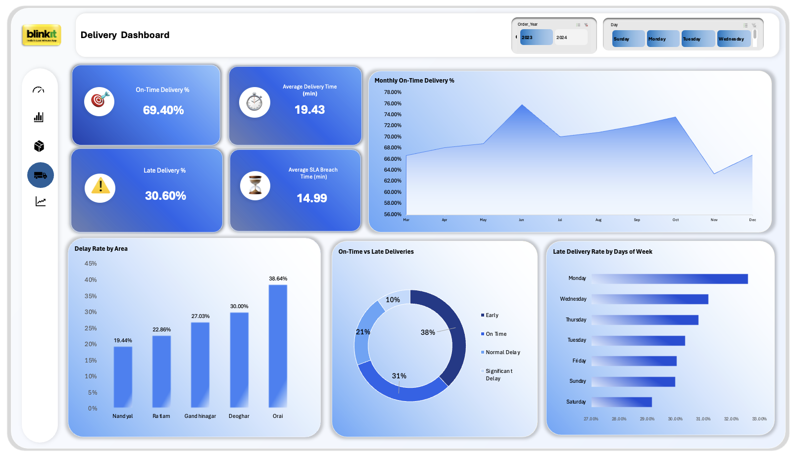
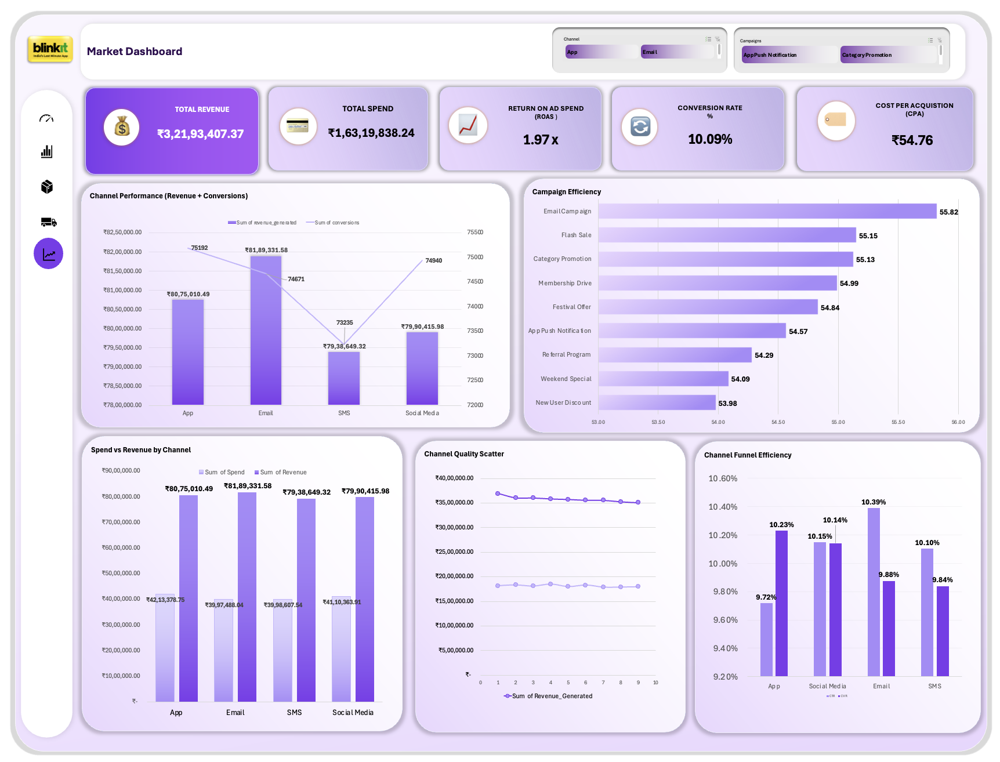

# 🛒 Blinkit Business Performance Analysis

### 📊 Excel Dashboard Project | Business Analytics | KPI Reporting

## 📌 Overview

Developed an integrated Excel dashboard solution to analyze Blinkit's business performance across Sales, Demand, Delivery, and Marketing functions. The project provides a centralized view of key business metrics to identify growth opportunities, operational bottlenecks, customer behavior patterns, and marketing effectiveness.

## 📸 Dashboard Preview

### 📈 Sales Dashboard

### 🚚 Delivery Dashboard

### 📣 Marketing Dashboard

## 📈 Key KPIs

* 💰 Gross Merchandise Value (GMV)
* 📦 Total Orders
* 👥 Customer Segmentation
* 🚚 On-Time Delivery Rate
* 📣 Marketing ROAS
* 🎯 Conversion Rate

## 🛠 Tools Used

* Microsoft Excel
* Power Query
* Pivot Tables
* Pivot Charts
* KPI Cards
* Slicers
* Dashboard Design

## 🔍 Key Insights

* 💰 Generated ₹1.10 Cr GMV across 5,000 orders.
* 🔄 Repeat customers contributed over 94% of total GMV.
* 📦 Dairy & Breakfast emerged as the highest-performing category.
* 🚚 Only 69.40% of deliveries met SLA targets, highlighting operational inefficiencies.
* 📣 Marketing campaigns achieved a ROAS of 1.97x.
* 📅 August and December recorded peak business performance.

## 🧹 Data Preparation

Data was cleaned, transformed, and modeled using Excel Power Query. Multiple datasets including Orders, Customers, Products, Delivery, and Marketing data were integrated to create business-ready dashboards and KPIs.

## 📂 Files Included

* 📄 Project Report
* 📊 Dashboard Workbook
* 🗂 Raw Dataset
* 🖼 Dashboard Screenshots

## 💡 Business Impact

* 📈 Enabled performance tracking across Sales, Demand, Delivery, and Marketing functions.
* 🎯 Identified growth opportunities, operational bottlenecks, and customer behavior trends.
* 💡 Supported data-driven business decisions through centralized KPI monitoring.

## 👨‍💻 Author

**Raj Thakare**
Data Analyst | Excel | SQL | Dashboard Development
